# 🎯 Habit Tracker App

A premium, Google-quality Habit Tracker application built with Flutter and Supabase. Designed to help users build and maintain positive habits through tracking, visualization, and smart reminders.

## ✨ Features

### 📅 Habit Management
*   **Create & Customize**: Add habits with custom icons (animals, activities), colors, and descriptions.
*   **Frequency**: Support for Daily and Weekly habits.
*   **Categories**: Organize habits into categories (Health, Work, Mindfulness, etc.).
*   **Archive**: Archive habits you no longer want to track without losing history.

## 📱 Screenshots

<p align="center">
  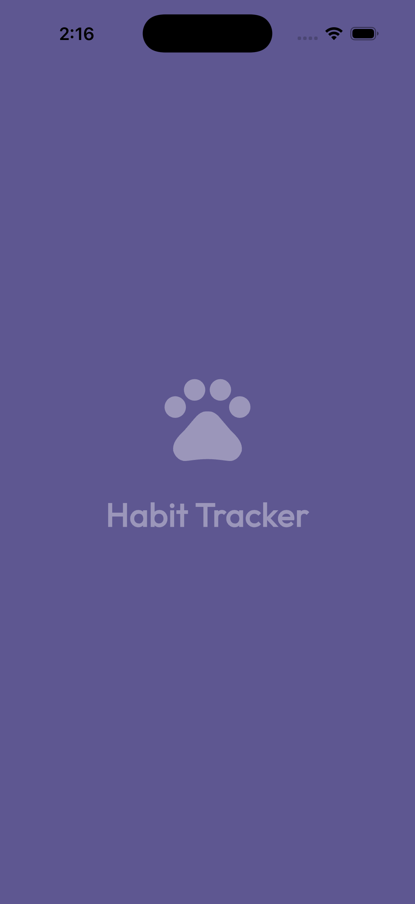
  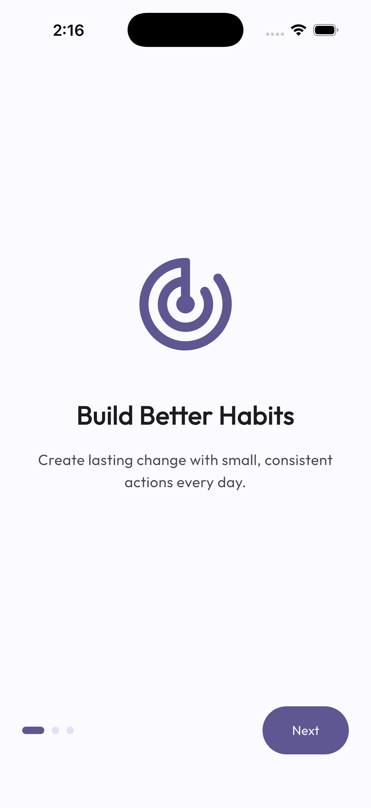
  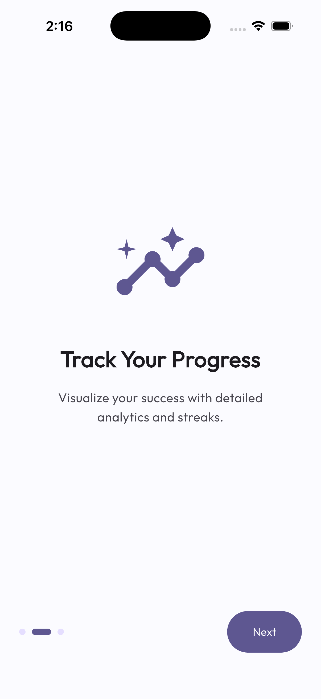
</p>

<p align="center">
  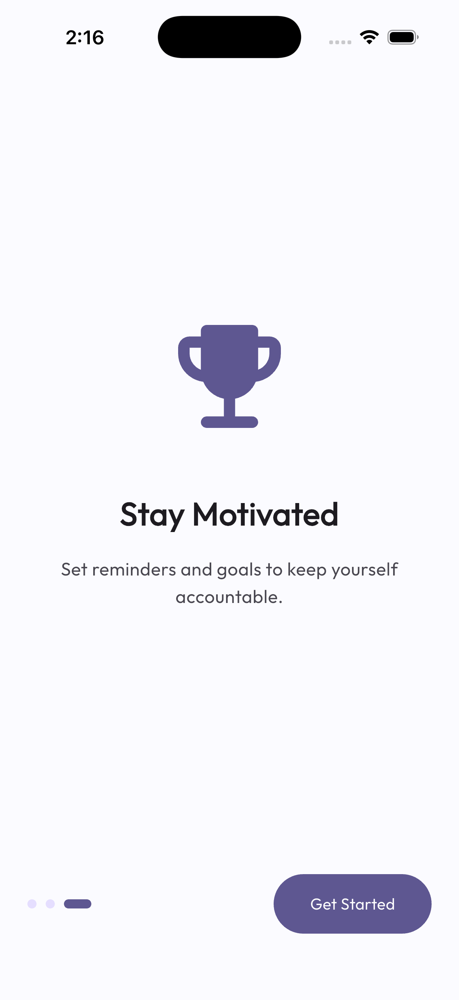
  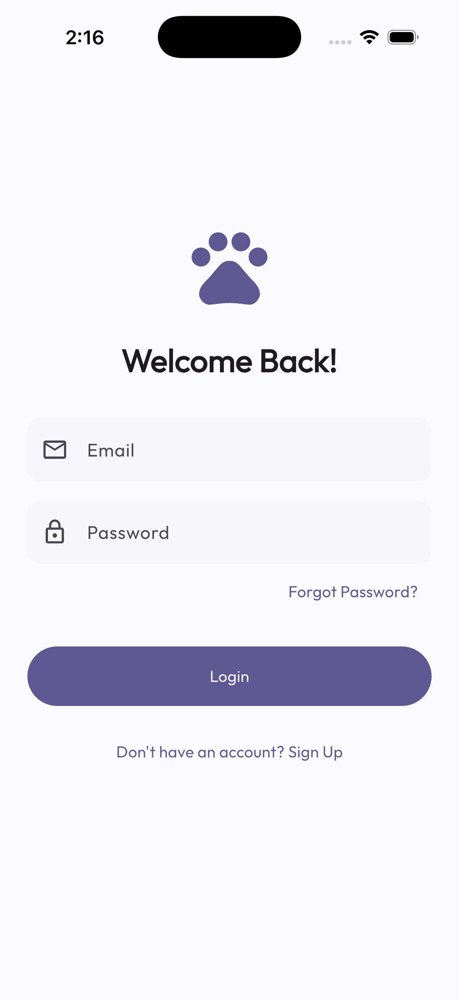
  
</p>

<p align="center">
  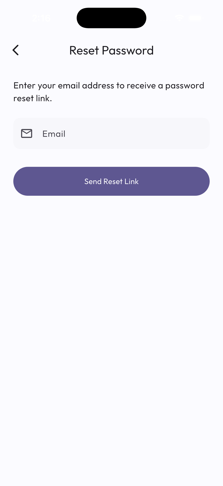
  
  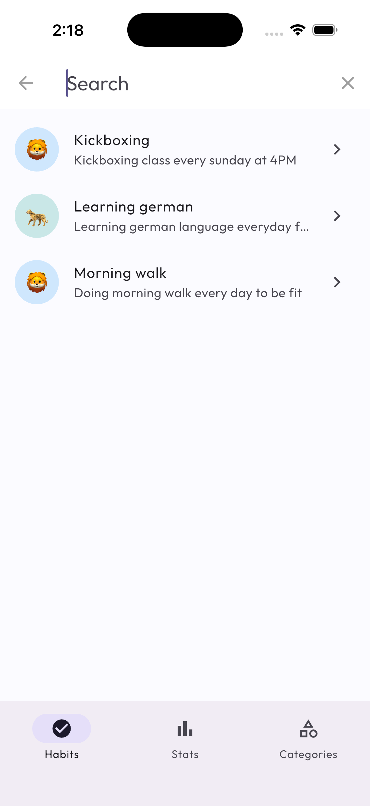
</p>

<p align="center">
  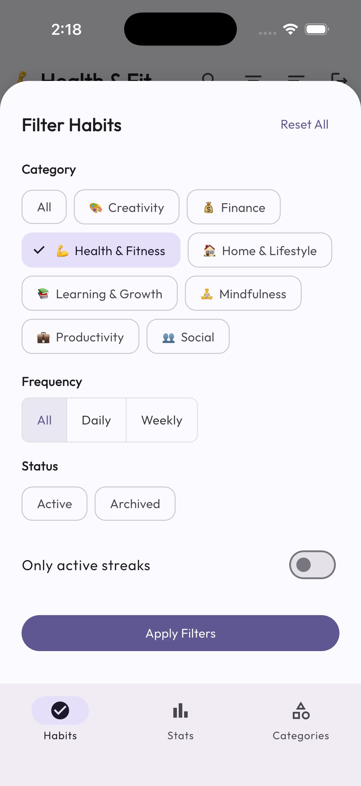
  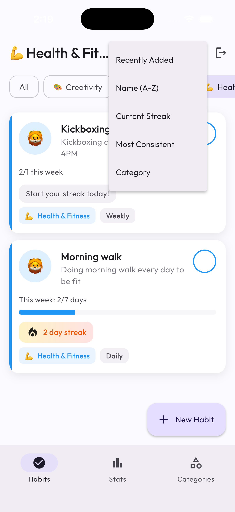
  
</p>

<p align="center">
  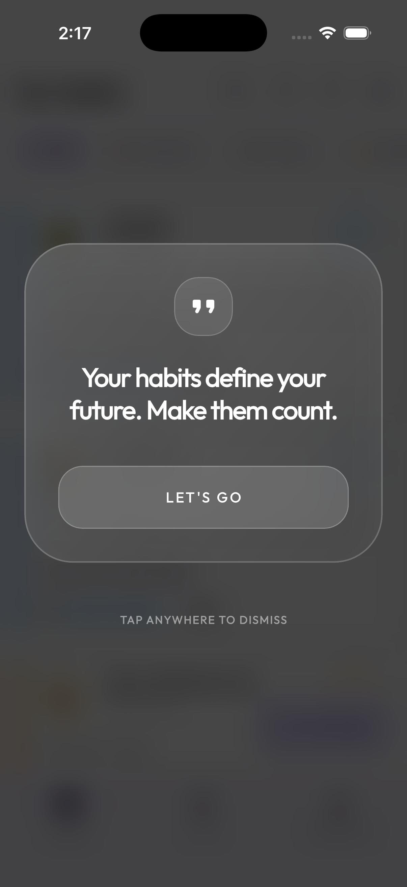
  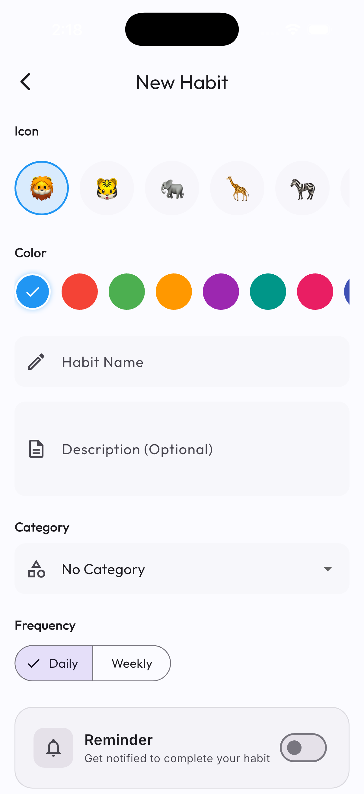
  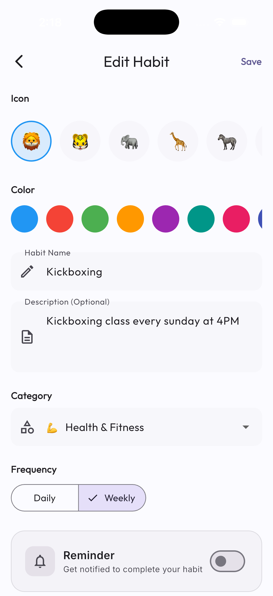
</p>

<p align="center">
  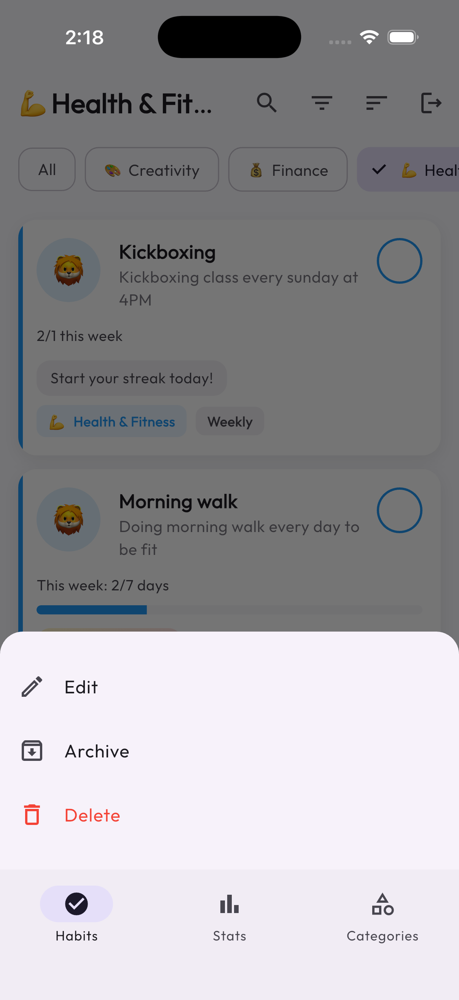
  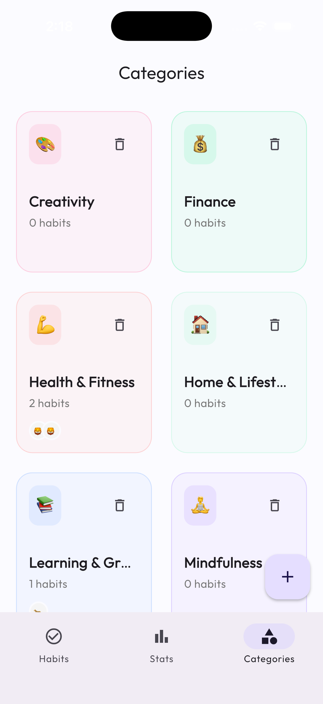
  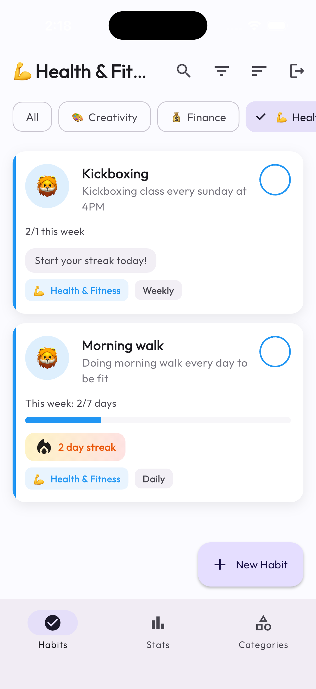
</p>

### 🚀 Tracking & Progress
*   **Overview**: Daily dashboard showing pending and completed habits.
*   **Streaks**: Track current and longest streaks to stay motivated.
*   **Completion History**: Visual calendar and list views of your journey.
*   **Statistics**:
    *   **Consistency Heatmap**: GitHub-style contribution graph.
    *   **Weekly Performance**: Bar charts showing completion rates.
    *   **Streak Timeline**: Line charts visualizing streak growth.

### 🔔 Smart Notifications
*   **Local Reminders**: Set specific times and days for habit reminders.
*   **Smart Content**: Notifications adapt based on your streak (e.g., "Don't break your 7-day streak! 🔥").
*   **Resilient Scheduling**: Reminders adhere to Android 13+ permissions and exact alarm scheduling.

### 🎨 Premium UI/UX
*   **Design System**: Material 3 implementation with custom extensions.
*   **Visuals**: Glassmorphism effects, rich gradients, and smooth animations.
*   **Theming**: Full support for Light and Dark modes.
*   **Accessibility**: Optimized contrast ratios and touch targets.

### 🔐 Authentication
*   **Secure Login**: Powered by Supabase Auth.
*   **Data Privacy**: Row Level Security (RLS) ensures users only access their own data.

## 🏗️ Architecture

The project follows valid **Clean Architecture** principles to ensure scalability and maintainability.

### Layers
1.  **Presentation Layer** (`lib/features/*/presentation`):
    *   **State Management**: `flutter_bloc` for predictable state changes.
    *   **UI Components**: Reusable widgets, pages, and themes.
    *   **Routing**: `go_router` for declarative navigation.

2.  **Domain Layer** (`lib/features/*/domain`):
    *   **Entities**: Pure Dart classes representing business objects (`HabitEntity`, `CategoryEntity`).
    *   **Use Cases**: Encapsulate specific business rules (`AddHabit`, `GetStreaks`).
    *   **Repositories (Interfaces)**: Abstract contracts for data operations.

3.  **Data Layer** (`lib/features/*/data`):
    *   **Models**: Data transfer objects (DTOs) with JSON serialization (`HabitModel`).
    *   **Repositories (Implementations)**: Concrete logic to fetch/save data.
    *   **Data Sources**: Direct interaction with Supabase and Local Storage.

### Core Stack
*   **Framework**: Flutter
*   **Backend**: Supabase (PostgreSQL + Auth)
*   **State Management**: Bloc / Cubit
*   **Dependency Injection**: `get_it`
*   **Local Notifications**: `flutter_local_notifications`
*   **Charts**: `fl_chart`

## 🚀 Getting Started

### Prerequisites
*   Flutter SDK (3.x)
*   Supabase Account

### Installation

1.  **Clone the repository**
    ```bash
    git clone https://github.com/yourusername/habit-tracker.git
    cd habit_tracker
    ```

2.  **Install Dependencies**
    ```bash
    flutter pub get
    ```

3.  **Setup Supabase**
    *   Create a new Supabase project.
    *   Go to the SQL Editor and run the contents of `supabase_full_schema.sql` to set up the tables, policies, and indexes.

4.  **Configure Environment**
    *   Create a `.env` file in the root directory (copy `.env.example` if available).
    *   Add your Supabase credentials:
        ```
        SUPABASE_URL=your_project_url
        SUPABASE_ANON_KEY=your_anon_key
        ```

5.  **Run the App**
    ```bash
    flutter run
    ```

## 📱 Database Schema

The complete database schema is located in `supabase_full_schema.sql`. It includes:
*   `habits`: Stores habit definitions.
*   `habit_completions`: Log of completed dates.
*   `categories`: Taxonomies for habits.
*   `streak_history`: Historical record of streak achievements.

## 🤝 Contributing

1.  Fork the Project
2.  Create your Feature Branch (`git checkout -b feature/AmazingFeature`)
3.  Commit your Changes (`git commit -m 'Add some AmazingFeature'`)
4.  Push to the Branch (`git push origin feature/AmazingFeature`)
5.  Open a Pull Request

## 📄 License

Distributed under the MIT License. See `LICENSE` for more information.
